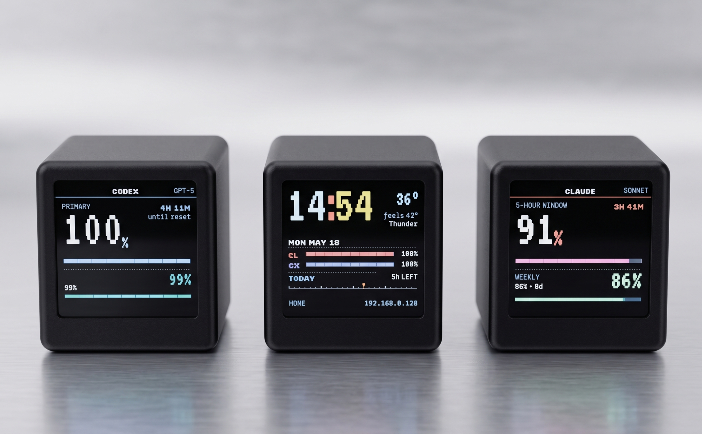

<p align="center">
  
</p>

# glimmer

> A pixel-art always-on desk widget. Custom firmware for the **GeekMagic
> SmallTV-Ultra** that rotates through glanceable channels — Claude / Codex
> usage, clock, weather, push cards — with crisp retro typography on a
> 240×240 panel.

---

## What it shows

| Channel | What |
|---|---|
| **Home** | At-a-glance clock + weather + Claude/Codex usage meters + 24-hour timeline |
| **Clock** | Big VT323 digital clock, day-of-week, greeting |
| **Weather Now** | Hero temp, feels/humidity/wind, 3-day mini cards |
| **5-day Forecast** | Range-bar rows showing min/max + condition |
| **Claude usage** | 5-hour window % + weekly % + reset countdowns |
| **Codex usage** | Primary % + secondary % + credits/reset |
| **AI Today** | Combined Claude+Codex card with 7-day mini chart |
| **Info** | IP / SSID / signal / uptime / heap / CPU / firmware |
| **Push cards** | One-shot notification cards via `POST /push` |

All channels render via region-based partial repaints — no flickering
between data updates.

## Quick start

```bash
git clone git@github.com:<you>/glimmer.git
cd glimmer
pio run -e nodemcuv2 -t buildfs    # build LittleFS image (fonts + web UI)
pio run -e nodemcuv2               # build firmware

# Flash a freshly-stocked SmallTV-Ultra (over your home LAN):
DEVICE_IP=<find via arp or device screen>
curl -F "filesystem=@.pio/build/nodemcuv2/littlefs.bin" http://$DEVICE_IP/update
curl -F "firmware=@.pio/build/nodemcuv2/firmware.bin"   http://$DEVICE_IP/update

# Device reboots into glimmer's setup AP. Connect to "glimmer-setup" Wi-Fi
# (open, no password) and visit http://192.168.4.1/ to enter your home
# Wi-Fi credentials.
```

For the full flashing dance (including the one-time "get the stock
firmware onto your Wi-Fi first" step), see **[FLASHING.md](./FLASHING.md)**.

## Hand this to Claude Code

You can let [Claude Code](https://claude.com/code) drive the flash for
you end-to-end — it will detect whether the device is brand-new (stock
firmware) or already on glimmer, walk you through joining the right
Wi-Fi AP, verify each step before continuing, build, OTA-flash, and
restore your config.

### From a clone of this repo

```
> /skill flash-device
```

### From anywhere (paste this prompt)

> Please flash glimmer firmware onto my GeekMagic SmallTV-Ultra.
> The skill at
> **https://github.com/Avinava/glimmer/blob/main/.claude/skills/flash-device.md**
> has the full walkthrough — fetch it, then walk me through:
>
> 1. Detect device state (brand-new stock vs already on glimmer).
> 2. Help me join the correct Wi-Fi AP (`GIFTV` for stock,
>    `glimmer-setup` after first glimmer flash).
> 3. Verify connectivity at every step (curl `/api/state` etc.) —
>    don't assume; always confirm with me before each handoff.
> 4. Build firmware + filesystem locally (`pio run` + `pio run -t buildfs`).
> 5. OTA-flash filesystem first, then firmware.
> 6. After full flash, restore my config from backup OR walk me
>    through first-time setup (Wi-Fi → tokens → channels → personalization).
>
> My device's current location: `<plugged in next to me / on the LAN at
> <ip>/glimmer.local>`. My laptop OS: `<macOS / Linux / Windows>`.

Claude will read the skill file, build the artifacts, and run the OTA
dance with you. Don't run any of the curl commands yourself unless
Claude asks — the order matters (filesystem flash wipes `/config.json`,
needs the AP-rejoin step to recover).

## Hardware

- **MCU**: ESP8266, 80–160 MHz, ~30 KB free RAM
- **Display**: 240×240 ST7789V IPS TFT (requires `invertDisplay(true)`)
- **Backlight**: PWM on GPIO5, **active-low** (0 = full bright, 1023 = off)
- **Flash**: 4 MB total → 3 MB sketch / 1 MB LittleFS (`eagle.flash.4m1m.ld`)
- **USB-C**: power only — no data wired to MCU
- **Network**: Wi-Fi 2.4 GHz only

### Known limitations

- ESP8266 BearSSL TLS is tight on heap — glimmer drops the VLW font
  cache before TLS calls (`Display::releaseFont()`). Don't add more
  long-lived heap allocations along the Claude/Codex fetch path.
- No PSRAM, no DMA double-buffer — channel rotation is a ~80 ms instant
  cut. Within-channel updates are region-based, smooth.
- Display panel needs the inversion bit; the web UI exposes
  `Invert colors` toggle in case a panel revision differs.

## Development

### Build

```bash
pio run -e nodemcuv2              # firmware
pio run -e nodemcuv2 -t buildfs   # filesystem
```

### Regenerate fonts

The repo ships with pre-built VLW bitmap fonts (`data/fonts/*.vlw`)
sized to match the design spec. To add a size or family, edit
`tools/genfonts.py`'s `FONT_MATRIX`, drop the TTF in `tools/ttf/`, and:

```bash
pip install freetype-py
python3 tools/genfonts.py
pio run -e nodemcuv2 -t buildfs
```

Or trigger via Claude Code:

```
> /skill regenerate-fonts
```

### Add a channel

1. Create `src/channels/ch_<name>.cpp` with `chXxxEnabled`, `chXxxDraw`,
   and (optional) `chXxxTick`.
2. Add a row to `kChannels[]` in `src/main.cpp`.
3. (Optional) Add a `showXxx` toggle in `src/core/storage.{h,cpp}`,
   `src/core/web.cpp`, and `data/web/index.html`.

See `src/channels/ch_clock.cpp` for the reference partial-redraw
implementation.

## Disclaimer — personal & educational use only

glimmer is shared for **personal experimentation and educational
purposes**.

It reads your own Claude and Codex usage by sending **your own
credentials** (a `sessionKey` cookie for claude.ai, a Bearer token for
chatgpt.com) to internal endpoints those services use to power their
web UIs. **These endpoints are undocumented and are not part of either
provider's public API.** They can change or be removed without notice,
and accessing them programmatically may be inconsistent with
Anthropic's or OpenAI's Terms of Service depending on interpretation.

By installing or modifying this firmware you accept full responsibility
for:

- Your own compliance with the relevant Terms of Service.
- Anything that happens on your own devices, accounts, or network.
- Securing your credentials — they are stored on the device's LittleFS
  partition in plaintext (the device runs on your home Wi-Fi behind
  your router).

This is a hobbyist project shared as-is, with no warranty, no support
guarantee, and no claim of fitness for any particular purpose. **Do not
redistribute as a commercial product. Do not use this to access accounts
that are not yours.**

## License

MIT. See [LICENSE](./LICENSE). The MIT license governs the code in
this repository; it does **not** waive any obligations you may have
under third-party Terms of Service (Anthropic, OpenAI, etc.). See the
Disclaimer above.

## Acknowledgments

- Inspired by [Clawdmeter](https://github.com/HermannBjorgvin/Clawdmeter) by Hermann Björgvin.
- GeekMagic SmallTV-Ultra — the hardware.
- [TFT_eSPI](https://github.com/Bodmer/TFT_eSPI) — display driver.
- [VT323](https://fonts.google.com/specimen/VT323),
  [Silkscreen](https://fonts.google.com/specimen/Silkscreen),
  [DM Mono](https://fonts.google.com/specimen/DM+Mono),
  [Pixelify Sans](https://fonts.google.com/specimen/Pixelify+Sans)
  — typography (all OFL).
